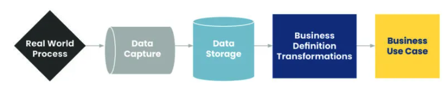
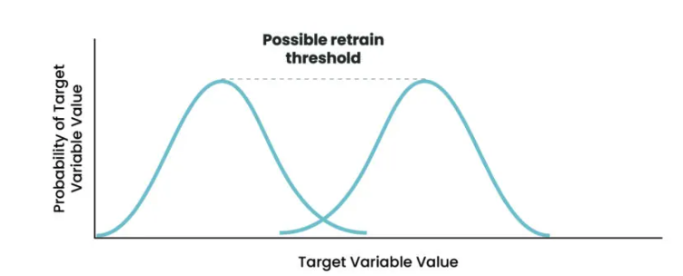
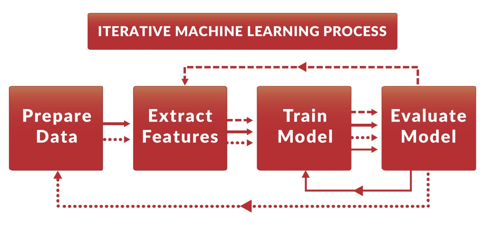

# MLOps Questions

## Model Monitoring and Drift
- [Model Monitoring](#model-monitoring)
  - [Cues for Retraining](#cues-for-retraining)
  - [Error Rate Based Drift Detection](#error-rate-based-drift-detection)
  - [Drift Detection on the Target Variable](#drift-detection-on-the-target-variable)
  - [Drift Detection on the Input Data](#drift-detection-on-the-input-data)
  - [Summary](#summary)
- [Explain about Model/Concept Drift](#explain-about-model-or-concept-drift)
- [Train/Serve Skew](#train-or-serve-skew)

## MLOps and Deployment
- [Rest API](#rest-api)
- [MLOps tool: MLFlow/Google Kubeflow/TensorFlow/Azure/AWS](#features-of-each-mlops-tool)
- [Create CI/CD Pipelines for ML](#how-to-create-cicd-pipelines-for-machine-learning)
- [**Scale** ML Model](#how-would-you-scale-your-ml-model)
- [Model **Versioning**](#how-to-maintain-model-versioning)
- [Testing **BEFORE** Deploying an ML Model into Production?](#what-types-of-testing-should-be-carried-out-before-deploying-an-ml-model-into-production)
- [Production Testing Techniques **AFTER** deployment](#what-production-testing-techniques-are-there)
- [Monnitoring **AFTER** Deployment](#what-are-the-important-steps-that-need-to-be-taken-care-of-after-deployment)
- [**CI/CD**: Continuous Integration vs Delivery vs Deployment](#whats-the-difference-between-continuous-integration-delivery-and-deployment)
- [Update a New Model with Little Downtime](#how-you-can-update-a-new-model-with-little-downtime)
- [Common Issues Involved in the Deployment of Machine Learning Models](#describe-some-common-issues-involved-in-the-deployment-of-machine-learning-models)
- [DevOps vs MLOps](#how-devops-and-mlops-are-different)
- [Stream Processing vs Batch Processing](#stream-processing-vs-batch-processing)
- [Ensure **Reproducibility** When Deploying Machine Learning Models](#how-can-we-ensure-reproducibility-when-deploying-machine-learning-models)
- [Immutable Infrastructure](#what-is-the-concept-of-immutable-infrastructure)
- [**A/B Split Approach*** to Model Evaluation?](#what-is-your-opinion-on-the-ab-split-approach-to-model-evaluation)

## DevOps, Docker, and Infrastructure
- [Difference Between CMD and Entrypoint](#difference-between-cmd-and-entrypoint)
- [Can There Be Multiple CMD Commands or Entrypoint Command?](#can-there-be-multiple-cmd-commands-or-entrypoint-command)
- [How to Run Multiple RUN Commands in One Line in a Docker File](#how-to-run-multiple-run-commands-in-one-line-in-a-docker-file)

## Data Management and Warehousing
- [Data Archiving](#data-archiving)
- [Data Warehousing](#data-warehousing)
- [What Are the 4 Key Components of a Data Warehouse?](#what-are-the-4-key-components-of-a-data-warehouse)
- [What Are the Steps to Build the Datawarehouse?](#what-are-the-steps-to-build-the-datawarehouse)
- [What Is Real-time Datawarehousing?](#what-is-real-time-datawarehousing)
- [What Is Active Datawarehousing?](#what-is-active-datawarehousing)
- [What Is the Difference Between OLTP and OLAP?](#what-is-the-difference-between-oltp-and-olap)
- [What Is the Difference Between Datawarehouse and OLAP?](#what-is-the-difference-between-datawarehouse-and-olap)


## Model Monitoring
The knowledge embedded in a machine learning model is a frozen snapshot of a real-world process imperfectly captured in data. Even if your machine learning (ML) models aren’t wrong now, drift will inevitably affect any model and cause it to lose accuracy over time. 
A change in any step in the model dependency pipeline may violate the statistical, technical, or business assumptions that were relied upon when the model was built, which will require the model to be retrained. 



[Back to TOC](#MLOps-Questions)    


### Cues for Retraining
we can monitor the input and outputs of our model and trigger model retraining upon the following events: 
- The model’s performance metrics have deteriorated.
- The distribution of predictions has changed from those observed during training. 
- The training data and the live data have begun to diverge and the training data is no longer a good representation of the real world.

Ideally, predictions and the inputs that produced them are logged and easily accessible to facilitate monitoring. The best approach is to tie the model calls to a unique ID which can be used to retrieve the prediction and logging data. If possible, this prediction should either immediately or eventually be tied to a ground truth label. These ground truths are then used to calculate and visualize a performance metric that should be made available to users across the organization. 

[Back to TOC](#MLOps-Questions)    


### Error Rate Based Drift Detection
Detecting drift based on model performance, or “error rate based drift detection,” ties directly to what we care most about — model performance — and is generally simple to implement. In this strategy, when we observe a significant dip in model performance, we retrain our model. The threshold for retraining should be determined based on the performance expectations set during model development. 

[Back to TOC](#MLOps-Questions)    


### Drift Detection on the Target Variable
Even without available labels, we can still monitor the distribution of predictions and compare it to the distribution of predictions that we observed over the training data. Prediction data for many use cases tend to be univariate or low dimensional, making some of the common methods for comparing distributions easier to implement and interpret. Some of the more common statistical tests used to compare distributions are the Z-test, Chi-squared, Kolmogorov–Smirnov, Jensen-Shannon, and Earth Mover’s Distance. No matter the chosen metric (similar to error rate-based drift detection) you’ll need to determine a threshold for when retraining becomes necessary.



[Back to TOC](#MLOps-Questions)    


### Drift Detection on the Input Data
we could generate baseline statistics from our training data for each feature and compare these statistics to those seen in the live data. Alternatively (or additionally), we can train a binary classifier to distinguish between training data and live data. Being able to distinguish between the training data and live data (a better-than-random AUC) suggests that the data has drifted.

[Back to TOC](#MLOps-Questions)    


### Summary
- Trace and understand the dependencies of your model.
- Select a drift detection method that’s appropriate for your model and data:
	- Error rate
	- Target variable
	- Input data
- Select a metric and threshold for retraining.
- When the threshold has been crossed:
	- Perform error analysis and debug model dependencies for insights
	- Retrain your model 
- Iterate and improve.
  
[Back to TOC](#MLOps-Questions)    


## Explain about Model or Concept Drift
Model drift, sometimes called concept drift, occurs when the model performance during the inference phase (using real-world data) degrades when compared to its performance during the training phase (using historical, labeled data). It is also known as train/serve skew as the performance of the model is skewed when compared with the training and serving phases. This could be due to many reasons like
- The underlying distribution of data has changed
- Unforeseen events - like a model trained on pre-covid data is expected to perform much worse on data during the COVID-19 pandemic
- Training happened on a limited number of categories but a recent environmental change happened which added another category
- In NLP problems the real world data has significantly more number of tokens that are different from training data
To detect model drift, it is always necessary to keep continuously monitoring the performance of the model. If there is a sustained degradation of model performance, the cause needs to be investigated and treatment methods need to be applied accordingly which almost always involves model retraining.

[Back to TOC](#MLOps-Questions)    


## Train or Serve Skew
The challenge is that all the processing steps need to be repeated when trying to derive inferences because the model expects the data on which predictions need to be issued to be in the same format as the training data.
If the prediction data differs significantly from the training data then it can be argued that there is a train/serve skew.
There are multiple ways to avoid train serve skew like:
- Maintain separate module files for data preprocessing (a separate class or module.py file)
- Compose a preprocessing graph using TFX transform graph etc
  
[Back to TOC](#MLOps-Questions)    


## Features of each MLOps tool

[Source](https://neptune.ai/blog/packaging-ml-models#:~:text=ML%20packing%20tools%20were%20created,track%20of%20this%20for%20you.)

| MLOps Features | MLFlow | Google Kubeflow | TensorFlow Lite & TensorFlow Extended | Azure Machine Learning | AWS SageMaker |
|----------------|--------|-----------------|----------------------------------------|------------------------|---------------|
| Data and Pipeline Versioning | No | Yes | Yes | Yes | Yes |
| Run Orchestration | Limited | Yes | Yes | Yes | Yes |
| Model and Experiment Versioning | Yes | Yes | Using Machine Learning Metadata (MLMD) | Yes | Yes |
| Hyperparameter Tuning / Optimization | Yes | Yes | Yes | Yes | Yes |
| Model Serving | Yes | Yes | Yes | Limited | Limited |
| Model Deployment and Monitoring in Production / Experiment Tracking | Yes | Yes | Yes | Yes | Yes |

| MLOps Features | MLFlow | Google Kubeflow | TensorFlow Lite & TensorFlow Extended | Azure Machine Learning | AWS SageMaker |
|----------------|--------|-----------------|----------------------------------------|------------------------|---------------|
| Open Source / Cloud | Open Source | Open Source | Open Source | Cloud | Cloud |
| Deployment On Premise | Yes | Yes | Yes | No | No |
| Experiment Data Storage | Local + Cloud | Cloud | Local | Cloud | Cloud |
| Easy Setup & Integration | Yes | No | Yes | Yes | Yes |
| Scalable for Large No. of Experiments | Yes | Yes | No | Yes | Yes |
| Custom Visualizations | Yes | Yes | Yes | Yes | Yes |

[Back to TOC](#MLOps-Questions)    


## How to Create CI/CD Pipelines for Machine Learning
If the technical stack is primarily AWS driven, Sagemaker pipelines can stand in for CI/CD pipelines.
Other approaches could be to use Kubeflow pipelines and traditional tools like Jenkins or even Github actions to build CI/CD pipelines.

[Back to TOC](#MLOps-Questions)    


## How Would You Scale Your ML Model
1. Scaling w.r.t. training data: retraining your model is absolutely necessary when underlying assumptions about the data change.
2. Scaling w.r.t. data deluge:Look for a distributed version of algorithms! with growth in business you have more data. With so much data, need parallel computing or batch processing and parallelize processes like cross-validation and hyperparameter tuning. Also important to use checkpoints while retraining serialized/pickled models so you do not have to rebuild it from scratch just because you received an additional 10k rows. The system can just catch up from where you left it last time.
3. Scaling w.r.t. framework: There are so many frameworks to choose from(SkLearn, Pytorch, Keras, Tensorflow, H2o, Theano). Choose the one will serve in the long run.
	1. what is the level of abstraction you desire
	2. compare the frameworks based on how good their community support is, how easily does it allow third-party integrations, and whether or not it can support Distributed ML
4. Scaling w.r.t. features: With more time, new predictor might weight in on feature importance. Need to make sure that the addition of these features is not leading towards overfitting the model by implement regularization techniques.
5. Scaling w.r.t. actual predictions: beware of slow models like SVM, KNN, or NN (neural nets), especially without GPU support.

Summarize:
- scaling to new data, new features
- serializing and creating checkpoints
- selecting an appropriate framework and processor
- parallelize computing — Distributed ML
- deployment using backend APIs or make it available to the world as hardware-accelerated models on the web
  
[Back to TOC](#MLOps-Questions)    


## How to Maintain Model Versioning
[Source](https://neptune.ai/blog/version-control-for-ml-models)



### Machine learning version control has three parts:
1. **Code**: There’s modelling code, and there’s implementation code. Modelling code is used to implement the model, and implementation code is used for inference. They can both be written in different programming languages, but it might make it more difficult to maintain all of your code and dependencies. 
2. **Data**: There’s metadata, which is information about your data and model. Then there’s the actual data, the datasets you use to train and run your model. Metadata can change without any change in the data, and versioning should link the data to the appropriate meta.
3. **Model**: The model connects all of the above with model parameters and hyperparameters.
	- **Model Selection:** Version each algorithm tested to track performance changes and isolate models in separate repositories for parallel testing.
	- **Model Training:** Track hyperparameters and trained parameters with version control to ensure reproducibility and facilitate analysis of individual changes.
	- **Model Evaluation:** Maintain versioned records of hold-out test sets and performance results to inform the integration of changes based on evaluation.
	- **Model Validation:** Version validation results and performance metrics to identify impactful changes and prepare versions for deployment.
	- **Model Deployment:** Keep track of deployed model versions and associated changes to manage staged deployments and enable quick rollbacks if necessary.

### Benefit:
- **Collaboration**: if you’re a solo researcher, this might not be important. When you work with a team and your project is complex, it becomes very difficult to collaborate without a version control system.   
- **Versioning**: while making changes, the model can break. With a version control system, you get a changelog which will be helpful when your model breaks and you can revert your changes to get back to a stable version.
- **Reproducibility**: by taking snapshots for the entire machine learning pipeline, you make it possible to reproduce the same output again, even with the trained weights, which saves the time of retraining and testing.
- **Dependency tracking**: tracking different versions of the datasets (training, evaluation, and development), tuning the model hyperparameters and parameters. By using version control, you can test more than one model on different branches or repositories, tune the model parameters and hyperparameters, and monitor the accuracy of each change.
- **Model Updates**: model development is not done in one step, it works in cycles. With the help of version control, you can control which version is released while continuing the development for the next release.

### Machine learning version control types
- **Distributed Version Control System (DVCS):**
	  - Stores the full codebase, including its history, locally on the developer's computer.
	  - Allows developers to merge and create branches locally without needing a network connection.
	  - Examples include Git.
	  - Advantages include the ability to work offline and not relying on a single server for backups, making it suitable for small projects or initial stages of development.
	  - The main drawback is the potential need for large storage space on the developer's computer as the project grows, to accommodate the entire history and all branch data.
- **Centralized Version Control System (CVCS):**
	  - Requires developers to check out the repository from a single centralized server that contains all files and their history.
	  - Simplifies controlling the codebase from one place and ensures everyone is aware of any changes.
	  - Can be slow if there are central server connection issues and poses a risk of having all backups in one location.
	  - Suitable for mature models used in products, especially when multiple teams are involved and there's a need to streamline the merging and change addition processes.
	  - Reduces the storage requirements on the developer's computer, as only a single version of the system is needed locally.

### How to implement model version control
- Create separate repositories for each model you’re going to implement;   
- Create a separate branch for each model parameter, hyperparameter or feature you want to evaluate;   
- Create an integration branch where you collect the features that you need based on the performance analysis done on each feature separately;   
- Evaluate the model on the integration branch;   
- Merge from the integration branch to the main branch and perform your validation;	
- Label the versions on the main branch with the version number.

### Tools
- Tools like DVC (Data Version Control) offer specialized version control for ML, allowing users to track datasets, ML models, and metrics, without storing them in Git.
- Other tools such as Mlflow and Neptune. They not only track versions but also monitor training runs, parameters, and results.

### Best Practice
- Track both datasets and models.
- Keep raw data immutable and version derivatives.
- Version pipelines, not just models.
- Automate as much as possible.
- Integrate with other tools like Jupyter, TensorBoard, etc.


[Back to TOC](#MLOps-Questions)    


## What Types of Testing Should Be Carried Out Before Deploying an ML Model into Production?
$\color{red}{\textsf{[Prior deployment]}}$

- Unit testing, which tests the individual components of the model; 
- integration testing, which tests how the different components of the model work together; and 
- performance testing, which tests how the model performs under different conditions.
  
[Back to TOC](#MLOps-Questions)    


## What Production Testing Techniques Are There?
$\color{red}{\textsf{[Post deployment]}}$

- Batch testing: By conducting testing in a setting different from that of its training environment, it verifies the model. Using metrics of choice, such as accuracy, RMSE, etc., batch testing is done on a group of data samples to verify model inference. 
- A/B testing: It is frequently used for analyzing marketing campaigns as well as for the design of services (websites, mobile applications, etc.).
	- Live or real-time data is divided or segmented into two sets, Set A and Set B.
	- Set A data is sent to the outdated model, while Set B data is sent to the updated model.
	- Depending on the business use case or processes, several statistical approaches can be used to evaluate model performance (for example, accuracy, precision, etc.) to determine whether the new model (model B) outperforms the old model (model A).
	- We then do statistical hypothesis testing: The null hypothesis says that the new model has no effect on the average value of the business indicators being monitored. According to the alternative hypothesis, the new model increases the average value of the monitoring business indicators.
	- Finally, we assess if the new model results in a significant improvement in certain business KPIs.
- A shadow or stage test: A model is evaluated in a duplicate of a production environment before being used in production (staging environment).
  
[Back to TOC](#MLOps-Questions)    


## What Are the Important Steps That Need to Be Taken Care of After Deployment?
$\color{red}{\textsf{[Post deployment]}}$

- **Collect feedback from pipeline**: Getting continuous feedback from a ML model in production can alert you to issues like performance decay, bias creep, andGetting continuous feedback from a ML model in production can alert you to issues like performance decay, bias creep, and training-serving skew. Feedback and iteration is an important parts of development and deployment processes, and you must consider these from the very beginning. training-serving skew. Feedback and iteration is an important parts of development and deployment processes, and you must consider these from the very beginning. Consider questions like:
	- How can we retrieve feedback from production models?
	- How can we ensure constant delivery?
	- How can we test new iterations of the model?
	- How can we iterate our model without interrupting its operation?
- **Model Monitoring on a business level**: The knowledge embedded in a machine learning model is a frozen snapshot of a real-world process imperfectly captured in data. Even if your machine learning (ML) models aren’t wrong now, drift will inevitably affect any model and cause it to lose accuracy over time.  To detect model drift, it is always necessary to keep continuously monitoring the performance of the model. A change in any step in the model dependency pipeline may violate the statistical, technical, or business assumptions that were relied upon when the model was built, which will require the model to be retrained. we can monitor the input and outputs of our model and trigger model retraining upon the following events: we can monitor the input and outputs of our model and trigger model retraining upon the following events: 
	- The model’s performance metrics have deteriorated.
	- The distribution of predictions has changed from those observed during training. 
	- The training data and the live data have begun to diverge and the training data is no longer a good representation of the real world.
	- The model’s performance metrics have deteriorated.
	- The distribution of predictions has changed from those observed during training. 
	- The training data and the live data have begun to diverge and the training data is no longer a good representation of the real world.
   
[Back to TOC](#MLOps-Questions)    


## What’s the Difference Between Continuous Integration, Delivery, and Deployment?
- **Continuous Integration (CI):** CI involves frequently merging all developer working copies to a shared mainline, promoting small and incremental code commits to easily identify issues.
- **Continuous Delivery (CD) vs. Continuous Deployment:** Both CD practices automate testing and deployment to various stages, but Continuous Delivery requires manual deployment to production, while Continuous Deployment automatically pushes changes to production upon successful merge into the mainline.
  
[Back to TOC](#MLOps-Questions)    


## How You Can Update a New Model with Little Downtime
- **Rolling UpdatesRolling Updates**: Rolling updates involve updating all instances of your model/application one by one. One by one the older pods are replaced with a newer ones. There is Rolling updates involve updating all instances of your model/application one by one. One by one the older pods are replaced with a newer ones. There is zero downtime in this approach. Useful when you want to make a quick update of your entire model line with a new version. Also allows you to roll back to an older version when needed. Mostly used in testing or staging environments where teams need to test out the new versions of the models. Useful when you want to make a quick update of your entire model line with a new version. Also allows you to roll back to an older version when needed. Mostly used in testing or staging environments where teams need to test out the new versions of the models.  $\color{red}{\textsf{[zero downtime in this approach.]}}$
  
- **Blue/GreenBlue/Green**: This form of deployment is essentially a server swap. There are two identical systems available. The user requests are routed to one of the systems, and the newer changes and updates are done on the other system. Once the updates are tested and verified, the user requests are routed to the newer system, essentially swapping out the old model for a new one. Can be done in both batch and real-time inferencing deployments. There is essentiallyform of deployment is essentially a server swap. There are two identical systems available. The user requests are routed to one of the systems, and the newer changes and updates are done on the other system. Once the updates are tested and verified, the user requests are routed to the newer system, essentially swapping out the old model for a new one. Can be done in both batch and real-time inferencing deployments. There is essentially zero downtime as we are just pointing the load balancer to a different set of machines. We will have to factor in the cost of maintaining two identical infrastructure systems. Choose this method depending on the scale and affordability of the infrastructure. zero downtime as we are just pointing the load balancer to a different set of machines. We will have to factor in the cost of maintaining two identical infrastructure systems. Choose this method depending on the scale and affordability of the infrastructure.  $\color{red}{\textsf{[zero downtime in this approach.]}}$
  
- **Automate deployment and testingAutomate deployment and testing**: It is possible to manage the deployment and testing of a single, small model manually. For larger or multiple models at scale, however, you should automate. This will enable you to manage individual components more easily, ensure that ML models will be automatically trained with data that is of consistently high quality, run automatic testing (e.g., of data quality and model performance), and scale models automatically in response to current conditions. It is possible to manage the deployment and testing of a single, small model manually. For larger or multiple models at scale, however, you should automate. This will enable you to manage individual components more easily, ensure that ML models will be automatically trained with data that is of consistently high quality, run automatic testing (e.g., of data quality and model performance), and scale models automatically in response to current conditions.
  
- **Prepare for container deploymentPrepare for container deployment**: This is because containers are predictable, repetitive, immutable, and easy to coordinate; they are the perfect environment for deployment.  They simplify deployment and scaling. ML models that are containerized are also easy to modify and update, which mitigates the risk of downtime and makes model maintenance less challenging. This is because containers are predictable, repetitive, immutable, and easy to coordinate; they are the perfect environment for deployment.  They simplify deployment and scaling. ML models that are containerized are also easy to modify and update, which mitigates the risk of downtime and makes model maintenance less challenging.
  
- Other form of deployment:Other form of deployment: Canary, A/B Testing, Shadow, Big Bang/RecreateCanary, A/B Testing, Shadow, Big Bang/Recreate

- **Batch inference**: deploy more complex models. Useful where model results are not needed immediately or in real-time. 
- **Online inference**: Online inference: real-time inference, inherent latency constraint: not possible to deploy complex models. real-time inference, inherent latency constraint: not possible to deploy complex models. 

	When deciding which method to use, consider questions like:When deciding which method to use, consider questions like:
	- How often do we need our model to generate predictions?
	- Should model results be based on batch data or individual cases?
	- How much computational power can we allocate?
	- How complex is our model?

[Back to TOC](#MLOps-Questions)    


## Describe Some Common Issues Involved in the Deployment of Machine Learning Models
– Ensuring that the model is able to run in the production environmenEnsuring that the model is able to run in the production environment	
– Managing model versions and dependencies– Managing model versions and dependencies	
– Automating model training and deployment	
– Automating model training and deployment	
– Monitoring model performance in production– Monitoring model performance in production	
– Handling data drift	

[Back to TOC](#MLOps-Questions)    


## How DevOps and MLOps Are Different

| Aspect                   | DevOps                                                                 | MLOps                                                                                                       |
|--------------------------|------------------------------------------------------------------------|-------------------------------------------------------------------------------------------------------------|
| **Focus**                | Application development                                               | Machine learning, leveraging data insights for business outcomes                                            |
| **Unique Processes**     | Automation of development and deployment processes                    | Model training, testing, and validation unique to MLOps                                                      |
| **Automation Emphasis**  |  Traditional software development tasks such as code builds and deployments                                              | Automated machine learning tasks, such as training models                                                   |
| **Approach**             | Improves communication between departments, putting people first      | Puts data first to identify patterns and improve customer experiences with less manual intervention         |
| **Data Role**            | Data is an output, not an input                                       | Data is a crucial input for building models; regular testing in production for performance degradation      |
| **Maintenance**          | Monitoring software applications for maintenance                      | Regular testing of models in production to address performance issues due to new data accumulation          |

[Back to TOC](#MLOps-Questions)    


## Stream Processing vs Batch Processing
- Batch process:
	- features from a prior point in time for a specific object, which is then utilized to generate real-time predictions.
	- we are able to do intensive feature calculations offline and have the data prepared for quick inference.
	- Features, however, an age since they were predetermined in the past. This might be a major drawback if your prognosis is based on recent occurrences.
- stream processing:stream processing:
	- give the model near real-time, streaming features
	- additional infrastructure is required for stream processing and to maintain data streams (Kafka, Kinesis, etc). (Apache Flink, Beam, etc.)
  
[Back to TOC](#MLOps-Questions)    


## How Can We Ensure Reproducibility When Deploying Machine Learning Models?
- **Training Process Replication:** Document every step of the training process to ensure it can be replicated precisely.
- **Consistent Deployment Environment:** Match the deployment environment closely with the training environment to maintain model performance.
- **Performance Monitoring:** Continuously monitor the model's performance post-deployment to identify and rectify any deviations or issues.

[Back to TOC](#MLOps-Questions)    


## What Is the Concept of “Immutable Infrastructure”?
- **Immutable Infrastructure Principle:** Treat infrastructure as immutable, meaning it should not be altered once deployed.
- **Change Management:** To make changes, deploy a new version of the infrastructure instead of modifying the existing setup.
- **Benefits:** This strategy helps prevent configuration drift and simplifies infrastructure management.
  
[Back to TOC](#MLOps-Questions)    


## What Is Your Opinion on the A/B Split Approach to Model Evaluation?
I think that the A/B split approach is a great way to evaluate models because it allows you to compare the performance of two models side-by-side. This can be especially helpful when you are trying to decide between two different models and you want to see which one performs better on a specific metric.I think that the A/B split approach is a great way to evaluate models because it allows you to compare the performance of two models side-by-side. This can be especially helpful when you are trying to decide between two different models and you want to see which one performs better on a specific metric.

[Back to TOC](#MLOps-Questions)    


## Difference Between CMD and Entrypoint
CMD - The CMD describes the default container parameters or commands. The user can easily override the default command when you use this. ENTRYPOINT - CMD - The CMD describes the default container parameters or commands. The user can easily override the default command when you use this. ENTRYPOINT - A container with an ENTRYPOINT is preferred when you want to define an executable. You can only override it if you use the --entrypoint flag.A container with an ENTRYPOINT is preferred when you want to define an executable. You can only override it if you use the --entrypoint flag.

[Back to TOC](#MLOps-Questions)    


## Can There Be Multiple CMD Commands or Entrypoint Command?
There can only be one CMD instruction in a Dockerfile. If you list more than one CMD then only the last CMD will take effect.There can only be one CMD instruction in a Dockerfile. If you list more than one CMD then only the last CMD will take effect.
There must be only one ENTRYPOINT in a Dockerfile. Only the last ENTRYPOINT instruction in the Dockerfile will have an effect.There must be only one ENTRYPOINT in a Dockerfile. Only the last ENTRYPOINT instruction in the Dockerfile will have an effect.

[Back to TOC](#MLOps-Questions)    


## How to Run Multiple RUN Commands in One Line in a Docker File
Instead of doing this
```
RUN python -m pip install --upgrade pip
RUN python -m pip install --upgrade setuptools
RUN pip install -r requirements.txt

RUN python -m pip install --upgrade pip
RUN python -m pip install --upgrade setuptools
RUN pip install -r requirements.txt
```

Try this
```
RUN python -m pip install --upgrade pip &&\
    python -m pip install --upgrade setuptools &&\
    pip install -r requirements.txt

RUN python -m pip install --upgrade pip &&\
    python -m pip install --upgrade setuptools &&\
    pip install -r requirements.txt

```
**Advantages with that approach**: Each instruction in the Dockerfile adds an extra layer to the docker image The number of instructions and layers should be kept to a minimum as it ultimately affects the build performance and time


[Back to TOC](#MLOps-Questions)    


## REST API

A REST API (Representational State Transfer Application Programming Interface) is a set of rules and conventions for building and interacting with web services. It allows different pieces of software, often running on different platforms and written in different languages, to communicate with each other over the internet.

Here are some key concepts and principles of REST APIs:

1. **Resources**: In REST, everything is considered a resource, which can be a document, an image, a temporal service (e.g., "today's weather in New York"), a collection of other resources, a non-virtual object (e.g., a person), and so on. Each resource is identified by a unique URI (Uniform Resource Identifier).

2. **Stateless**: Each request from a client to a server must contain all the information the server needs to fulfill the request (authentication, payload, etc.). The server does not store any session information about the client.

3. **Methods**: REST uses a set of standard HTTP methods, which are intended to perform specific actions on the resources. The most common HTTP methods are:
   - `GET`: Retrieve a resource or a list of resources.
   - `POST`: Create a new resource.
   - `PUT`: Update an existing resource.
   - `DELETE`: Remove a resource.
   - `PATCH`: Apply a partial update to a resource.

4. **Representations**: When a client requests a resource, the server sends the client a representation of the resource. This representation is typically in a format like JSON (JavaScript Object Notation) or XML (eXtensible Markup Language). The client can then modify the resource and send it back to the server.

5. **Stateless Interactions**: Each request from the client to the server must contain all the information needed to understand the request, and cannot take advantage of any stored context on the server. Session state is therefore kept entirely on the client.

6. **Uniform Interface**: REST APIs are designed to use a uniform set of operations (the HTTP methods mentioned above), which helps to decouple the client and server implementations. This means that, for example, any client that understands HTTP can interact with the REST API without needing to know anything about the underlying application.

7. **Layered System**: REST allows for a layered system architecture where client and server cannot ordinarily tell whether they are connected directly to each other or if there are intermediaries between them.

8. **Cacheable**: Responses must, implicitly or explicitly, define themselves as cacheable or not to prevent clients from getting outdated or inappropriate data in response to further requests.

REST APIs are widely used in web services and are a key component of modern web development. They provide a simple and standardized way to exchange data between different systems and are particularly useful in microservices architectures, where different services need to communicate with each other over the network.

[Back to TOC](#MLOps-Questions)   


## Data Archiving
[Back to TOC](#MLOps-Questions)    


## Data Warehousing
[Back to TOC](#MLOps-Questions)    


## What Are the 4 Key Components of a Data Warehouse?
[Back to TOC](#MLOps-Questions)    


## What Are the Steps to Build the Datawarehouse?
[Back to TOC](#MLOps-Questions)    


## What Is Real-time Datawarehousing?
[Back to TOC](#MLOps-Questions)    


## What Is Active Datawarehousing?
[Back to TOC](#MLOps-Questions)    


## What Is the Difference Between OLTP and OLAP?
[Back to TOC](#MLOps-Questions)    


## What Is the Difference Between Datawarehouse and OLAP?
[Back to TOC](#MLOps-Questions)    

