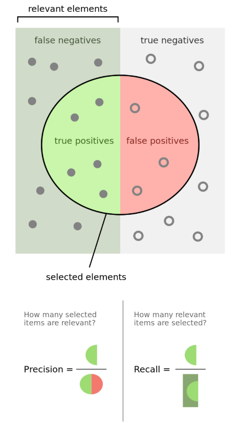
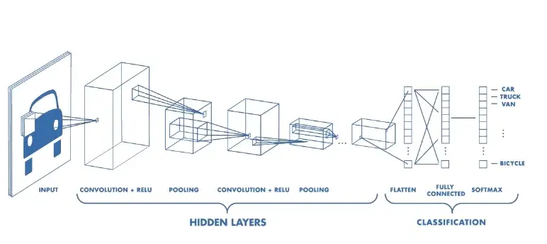
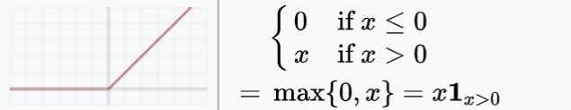

# ML Questions

## Machine Learning Concepts
- [Bias & Variance Trade Off](#bias--variance-trade-off)
   - [Definition](#definition)
   - [Bias](#bias)
   - [Variance](#variance)
- [**Overfitting**: Techniques for Reducing Variance](#techniques-for-reducing-variance)
- [Techniques for Reducing Bias](#techniques-for-reducing-bias)
- [Interpret linear regression coefficients?](#how-do-you-interpret-linear-regression-coefficients)

## Data Preparation and Feature Engineering
- [How does one Collect Data and Prepare Dataset for Training?](#how-does-one-collect-data-and-prepare-dataset-for-training)
- [Data Cleaning](#data-cleaning)
- [Handle Missing Data](#handle-missing-data)
- [Label Imbalance](#label-imbalance)
- [How to Feature Selection](#how-to-feature-selection)
- [Why Normalization?](#why-normalization)
- [Too Many Categories in Categorical Features](#too-many-categories-in-categorical-features)
- [Feature Engineering](#feature-engineering)
- [Identifying Data Mismatch](#identifying-data-mismatch)
- [Addressing Data Mismatch](#addressing-data-mismatch)
- [Would an Additional Feature Improve GBM or Logistic Regression More?](#would-an-additional-feature-improve-gbm-or-logistic-regression-more)

## Ensemble Methods
- [Bagging vs Boosting](#bagging-vs-boosting)
- [Xgboost vs Random Forest](#difference-between-xgboost-and-random-forest)
- [Random Forest VS Decision Tree](#random-forest-vs-decision-tree)
- [How to Prune Decision Tree](#how-to-prune-decision-tree)

## Model Evaluation and Performance Improvement
- [Procedure for Hyperparameter Tuning](#procedure-for-hyperparameter-tuning)
- [Improve Poor Model Performance](#improve-poor-model-performance)
- [AUC and ROC](#auc-and-roc)
- [F1 Score](#what-is-the-intuition-behind-the-f1-score)
- [Type I vs Type II error](#What-is-the-difference-between-a-Type-I-and-Type-II-error)
- [Lasso L1 and Ridge L2](#lasso-and-ridge)
- [Entropy vs Information Gain](#What-is-the-difference-between-Entropy-and-Information-Gain)
- [Test the effectiveness of an ML model](#What-evaluation-approaches-would-you-use-to-gauge-the-effectiveness-of-an-ML-model)

## Deep Learning and CNN
- [CNN](#cnn)
    - [Convolution Layer](#convolution-layer)
    - [Pooling Layer](#pooling-layer)
    - [Fully Connected Layer](#fully-connected-layer)
    - [Non-Linearity Layers: Activation functions](#non-linearity-layers)
- [Vanishing Gradient](#vanishing-gradient)
- [Exploding Gradient](#exploding-gradient)
- [Resnet](#resnet)
- [MobileNet](#mobilenet)
- [Keras vs Tensorflow vs Pytorch](#keras-vs-tensorflow-vs-pytorch)
- [Dropouts](#What-are-dropouts)


## Model Design and Cases
- [Build a Bank Fraud Detection Model](#how-would-you-build-a-bank-fraud-detection-model)
- [Model design: object detection](#Model-design-object-detection)
    - [How to make it efficient?](#make-it-efficient)
- [Optimize routes for gas technicians](#Optimize-routes-for-gas-technicians)
- [Write a program to retrieve log data in an optimal way](#Write-a-program-to-retrieve-log-data-in-an-optimal-way)

## Miscellaneous Topics
- [Unreasonable Effectiveness of Data](#unreasonable-effectiveness-of-data)
- [Maximum likelihood estimation](#what-is-maximum-likelihood-estimation)
- [LDA: Linear discriminant analysis](#what-is-linear-discriminant-analysis)
- [Parametric vs Non Parametric Algorithms](#what-is-the-difference-between-parametric-and-non-parametric-algorithms)


## Bias & Variance Trade Off
### Definition
Of the changes you could make to most learning algorithms, there are some that reduce bias errors but at the cost of increasing variance, and vice versa.
### Bias
- An error due to overly simplistic/erroneous assumptions. 
- Model underfitting: low predictive accuracy.
### Variance
- An error due to complexity in the learning algorithm. 
- highly sensitive to high degrees of variation: overfit the data. 
- carrying noise from your training data. 

[Back to TOC](#ML-Questions)

## Techniques for Reducing Variance
1. Add more data
2. Add penalties(L1 and L2)
3. Cross-validation
4. Early stopping and drop out
5. Feature selection 
6. Decrease model size
7. Modify input features based on insights from error analysis
8. Modify model architecture

[Back to TOC](#ML-Questions)


## Techniques for Reducing Bias
1. Increase the model size
2. Modify input features based on insights from error analysis (boosting)
3. Reduce/eliminate regularization
4. Modify model architecture
   
[Back to TOC](#ML-Questions)


## Data Cleaning
2. Remove irrelevant data
3. Standardize capitalization
4. Convert data type
5. Clear formatting
6. Fix errors
7. Language translation
8. Handle missing values
   
[Back to TOC](#ML-Questions)


## Handle Missing Data
Three types of missing data values:
1. Missing Completely at Random: No pattern to the missing data.
2. Missing at Random (MAR): Missing data can be explained by other data in the dataset.
3. Missing Not at Random (MNAR): Missing value is related to the value itself.

Three strategies for handling missing data:
1. **Deleting Rows**: Removing rows with missing values, which can lead to loss of information.   
2. **Imputing Data**: Filling in missing data based on information in the column or other columns in the dataset.
3. **Using Classification or Regression Models**: Predicting missing values using models.

[Back to TOC](#ML-Questions)


## Label Imbalance
1. **Resampling**:
	- Down-sampling the majority class:  model converge faster. However, lead to losing potentially important data.
	- Over-sampling the minority class: better representation of the minority class.
2. **Synthetic data generation**:ing techniques like the Synthetic Minority Over-sampling Technique (SMOTE).
3. **Cost-sensitive learning**: Assigning different weights to samples from different classes to account for the imbalance in the loss function used to train the model.
4. **Ensemble methods**: trained on different subsets of the data with boosting or bagging.
5. **Precision-oriented modeling**: Some models are better suited for evaluation metrics sensitive to imbalanced datasets, such as precision. For example, in decision trees and their variants – like random forest, boosted trees, etc. – one can prune paths with high entropy or with sparse samples. Alternatively, models that generate probability-based outputs, such as logistic regression, can be thresholdedto attain the desired performance outcomes.
**Insider Tip**:  particularly with large capacity models, best to do nothing.

[Back to TOC](#ML-Questions)


## How to Feature Selection
1. **Filter**:
   	- correlation coefficient
	- statistical tests such as ANOVA
	- mutual information
	- information gain
 	- chi-squared test
3. **Business Insight**
4. **Algorithmic**:
	- Random Forest: feature importance. 
 	- L1 regularization: shrink less informative features weight to 0.

[Back to TOC](#ML-Questions)


## Procedure for Hyperparameter Tuning
In **grid search**, a predefined set of hyperparameters are evaluated exhaustively: can be inefficient. 

**Bayesian optimization**: uses a probabilistic model to simulate the relationship between hyperparameters and the model performance: using an acquisition function that guides the search by balancing exploration (sampling new hyperparameters) and exploitation (evaluating promising hyperparameters). $\color{red}{\textsf{complex models and large datasets}}$

**genetic algorithm**, models represent combinations of hyperparameters ("genes"). The process involves selecting the fittest models from each generation in an iterative manner. The surviving models undergo modification ("mutation") or recombination ("crossover") of their hyperparameters. $\color{red}{\textsf{complex models and large datasets}}$

[Back to TOC](#ML-Questions)


## Improve Poor Model Performance
1. **Overfitting or underfitting?**
2. **Define the problem**: 
	- Is the model compiling?
 	- Are there runtime issues?
	- Is the loss not converging,
	- or simply too high?
	- Are model predictions outside of expected bounds?
3. **Visualize the data**:
	- Plot the data to check for patterns, outliers, corruption.
	- Determine whether the dataset is being sampled properly,
	- any ingestion issues.
	- Check the data before and after preprocessing
		- too much missing values
	  	- handled incorrectly
		- numerical features are not properly normalized
5. **Step through the model**: Inspect the model state at each layer for several steps. Print the outputs of all tensor operations, including outputs of activation functions. It is common to discover problems such as incorrect tensor operations, outliers, NaNs, and improper inputs at this stage.
6. **Loss**: Verify the loss computation is correct. Check the learning rate, gradient computation, and layer weights. After several steps, verify optimizer behaviors like momentum.
7. **Simplify the model**: If model performance is still difficult to troubleshoot, simplify all components of the model. Ingest fewer layers, and use a simple optimizer like SGD. Use fewer parameters, ensure the optimizer converges. Once the model is converging and metrics are moving in the right direction, incrementally add complexity back and verify once more.
8. **Debugging with TensorBoard**: Use TensorBoard to visualize the training process, such as loss over time, to help identify issues with the model. For instance, if the model shows signs of overfitting, apply regularization or early stopping.
9. **Model tuning**: To get better performance, experiment with various components of the model:
	- Feature selection
	- Feature preprocessing
	- Layers
	- Training label
	- Loss function
Further considerations include layer activations, hyperparameters, and model architecture.

[Back to TOC](#ML-Questions)


## Bagging vs Boosting

Bagging and Boosting are both ensemble techniques in machine learning, where multiple models (often of the same type) are trained to solve the same problem and combined to get better results. The key idea behind these methods is that a group of weak learners can come together to form a strong learner. Despite their similarities, they have distinct differences in how they approach building the ensemble of models.

### Bagging (Bootstrap Aggregating)

**Key Concepts:**
- **Parallel Ensemble**: Each model in the ensemble votes independently, and their predictions are combined through averaging (for regression) or majority voting (for classification).
- **Bootstrap Sampling**: Creates different training datasets by randomly sampling with replacement from the original dataset. Each model gets a slightly different dataset, which helps in reducing variance.
- **Equal Weighting**: Each model in the ensemble has an equal vote on the final outcome.

**Objective**: Primarily aims to reduce variance and overfitting in complex models.

**Example**: **Random Forest** is a popular bagging ensemble method that uses multiple decision trees.

### Boosting

**Key Concepts:**
- **Sequential Ensemble**: Models are added sequentially to correct the errors made by previous models. Later models focus more on the data points that were misclassified or had a higher error by earlier models.
- **Weighted Data Points**: Misclassified or harder to predict data points are given more weight, so subsequent models focus more on them.
- **Weighted Voting**: The final prediction is made based on a weighted vote, where more accurate models have more influence.

**Objective**: Aims to reduce both bias and variance by focusing on reducing errors from previous models, making it powerful but also prone to overfitting if not carefully tuned.

**Example**: AdaBoost (Adaptive Boosting) and Gradient Boosting are well-known boosting methods.

### Comparison

| Feature | Bagging | Boosting |
|---------|---------|----------|
| **Model Building** | Models are built independently. | Models are built sequentially to correct the predecessors' errors. |
| **Sampling Method** | Uses bootstrap sampling to create different training datasets. | Reweights the data to focus on more difficult cases. |
| **Decision Making** | Takes an equally weighted average or majority vote of its models. | Uses a weighted average or vote, giving more influence to better-performing models. |
| **Objective** | Aims to reduce variance and avoid overfitting, suitable for high-variance, low-bias models. | Aims to reduce both bias and variance but may increase the risk of overfitting. |
| **Example Methods** | Random Forest. | AdaBoost, Gradient Boosting. |

If the problem is that the single model gets a very low performance, Bagging will rarely get a better bias. However, Boosting could generate a combined model with lower errors as it optimises the advantages and reduces pitfalls of the single model.
By contrast, if the difficulty of the single model is over-fitting, then Bagging is the best option. Boosting for its part doesn’t help to avoid over-fitting; in fact, this technique is faced with this problem itself. For this reason, Bagging is effective more often than Boosting.

| Similarities | Differences |
|--------------|-------------|
| Both are ensemble methods to get N learners from 1 learner | … but, while they are built independently for Bagging, Boosting tries to add new models that do well where previous models fail. |
| Both generate several training data sets by random sampling | … but only Boosting determines weights for the data to tip the scales in favor of the most difficult cases. |
| Both make the final decision by averaging the N learners (or taking the majority of them) | … but it is an equally weighted average for Bagging and a weighted average for Boosting, more weight to those with better performance on training data. |
| Both are good at reducing variance and provide higher stability | … but only Boosting tries to reduce bias. On the other hand, Bagging may solve the over-fitting problem, while Boosting can increase it. |

[Back to TOC](#ML-Questions)


## How does one Collect Data and Prepare Dataset for Training?
1. Collect data: sampling technique random shuffle
2. Clean: missing or duplication, outlier, noise. 
3. Label: human annotators or historic data
4. Split: train and test 
5. Feature engineering on train first and then apply the same logic to test to prevent data leak. Check for data imbalance
6. Shuffle and train

[Back to TOC](#ML-Questions)


## Why Normalization?
Bring all the features to a similar scale, so no single feature dominates the learning process.

1. **Faster Convergence**: The optimizer doesn't have to deal with differing scales for different features.
2. **Stabilize Gradient Steps**: Helps in stabilizing the gradient descent steps.
3. **Equal Importance**: Ensures that all features have equal importance in the learning process.
4. **Improved Performance**: Some algorithms, such as k-Nearest Neighbors and neural networks, are sensitive to the scale of the features.
5. **Requirement for Some Algorithms**: Certain machine learning algorithms, such as Support Vector Machines and Principal Component Analysis, require normalization to function correctly.
   
[Back to TOC](#ML-Questions)


## Too Many Categories in Categorical Features
### Approach1: Use domain knowledge:
1. Decrease the number of groups and apply one-hot encoding: Think of the meaningful ways to map your data to several larger categories. Then one-hot encode.
2. Quantitative mapping: designate each category with a score or statistic.
### Approach2: Learn from the output variable
1. Calculate aggregated value per group
	- classifier: ratio of positive labels / group
	- regression: mean target value / group
2. Calculate normalized aggregated value per group: weight of evidence score & Perlich aggregations
   
[Back to TOC](#ML-Questions)


## Would an Additional Feature Improve GBM or Logistic Regression More?
Too many features causes overfitting problems:
1. **Curse of Dimensionality**: Too many features result in the Curse of dimensionality.
2. **Sparse Data**: Curse of dimensionality results in data being sparse (especially if datapoints are too few).
3. **Model Overfitting**: Data being sparse results in model overfitting.

As we add more features, the available data points in our feature space become exponentially sparser, which makes it easier to separate the data points. Yet, it’s not because of any pattern in the data, in actuality it’s just the nature of higher dimensional spaces. Because of this inherent sparsity, we end up overfitting when we add more features to our data. This means we need more data to avoid sparsity — and that’s the curse of dimensionality: as the number of features increase, our data become sparser, which results in overfitting, and we therefore need more data to avoid it.

[Back to TOC](#ML-Questions)


## Feature Engineering
### Def
the act of converting raw observations into desired features using statistical or machine learning approaches. Feature engineering is a machine learning technique that leverages data to create new variables that aren’t in the training set. It can produce new features for both supervised and unsupervised learning, with the goal of simplifying and speeding up data transformations while also enhancing model accuracy.
### Importance
1. **Enhanced Predictive Power**: helps models to better capture the underlying patterns and relationships, improving their predictive accuracy.
2. **Noise Reduction**: filter out irrelevant noise.
3. **Revealing Subtle Patterns**: The process can uncover subtle patterns that might be hidden in the raw data.
4. **Task-Specific Customization**: tailors features to the specific needs of the modeling task, ensuring that the input data is optimally suited for the problem at hand.
5. **Capturing Non-Linear Relationships**: Engineered features can reveal non-linear relationships that simpler, linear models might miss, thereby enhancing model complexity and adaptability.
6. **Model Resilience**: Features that are well-engineered contribute to a model's robustness, helping it to maintain performance even as data distributions change over time.
7. **Domain Expertise Integration**: Incorporating domain knowledge into feature engineering can capture important nuances that raw data might not reflect, aligning the features more closely with the problem domain.
8. **Dimensionality Reduction**: Thoughtful feature engineering can reduce the number of input features, which simplifies the model and reduces computational costs.
9. **Improved Interpretability**: By encapsulating meaningful insights, engineered features can make models more interpretable and understandable to stakeholders.
### Techniques
1. **Imputation**:
   - Handle missing values in your dataset.
   - Replace missing values with the mean, median, mode, or use more advanced imputation techniques like K-Nearest Neighbors (KNN) or regression imputation.
2. **One-Hot Encoding**:
   - Convert categorical variables into a binary matrix.
   - Use tools like `pandas.get_dummies()` in Python or `OneHotEncoder` from scikit-learn.
3. **Label Encoding**:
   - Convert categorical labels into numerical values.
   - Use `LabelEncoder` from scikit-learn.
4. **Target Encoding**:
   - Encode categorical features based on the mean of the target variable for each category.
   - Implement target encoding manually or use libraries like `category_encoders` in Python.
5. **Frequency Encoding**:
   - Encoding categorical variables based on their frequency or occurrence in the dataset.
6. **Cyclical Encoding**:
   - Encoding cyclical features, such as time or angles, using sine and cosine transformations.
7. **Binning or Discretization**:
   - Convert numerical variables into categorical ones by grouping them into bins or intervals.
   - Use `pandas.cut()` or `pandas.qcut()` for equal width or quantile binning, respectively.
8. **Scaling**:
   - Standardize or normalize numerical features to ensure they have similar scales.
   - Use `StandardScaler` or `MinMaxScaler` from scikit-learn.
9. **Log Transform**:
   - Apply the logarithm transformation to skewed numerical features to make their distribution more normal.
   - Use `numpy.log()`.
10. **Aggregation**:
    - Creating aggregated features by summarizing or aggregating information across groups or categories.
11. **Outlier Handling**:
    - Identifying and handling outliers by transforming or capping extreme values.
12. **Cumulative Features**:
    - Creating features that represent cumulative sums or averages over time or within specific groups.
13. **Hashing**:
    - Hashing categorical variables to generate fixed-size representations, useful for high-cardinality features.
14. **Embeddings**:
    - Representing categorical variables using embeddings, which capture relationships between categories.
15. **Cross-Validation Features**:
    - Creating features based on cross-validation folds, such as mean or standard deviation of predictions.
16. **Cluster Labels**:
    - Assigning cluster labels to data points based on clustering algorithms, creating new categorical features.
17. **Feature Splitting**:
    - Splitting combined features or extracting information from them to create new features.
18. **Feature Extraction**:
    - Reduce dimensionality by extracting important features.
    - Principal Component Analysis (PCA), Linear Discriminant Analysis (LDA), or feature selection methods like Recursive Feature Elimination (RFE).
19. **Interaction Terms**:
    - Create new features by combining existing ones.
    - Sum, difference, product, or ratio of two variables.
20. **Polynomial Features**:
    - Generate polynomial features to capture non-linear relationships.
    - Use `PolynomialFeatures` from scikit-learn.
21. **Time-Based Features**:
    - Extract features related to time, such as day of the week, month, or season.
    - Use functions like `datetime` in Python to extract relevant information.
    - Roll-over time series 
22. **Text Processing**:
    - Convert text data into numerical features.
    - Use methods like Bag of Words, TF-IDF, or Word Embeddings
23. **Date and Time Features**:
    - Extracting relevant information from date and time data, such as day of the week, month, or time differences.
24. **Handling Skewed Data**:
    - Address skewness in numerical features.
    - Apply transformations like Box-Cox or Yeo-Johnson.
25. **Custom Transformations**:
    - Assume you want to create a custom transformation function.
### Challenges and Considerations
#### 1. Overfitting
- **Risk**: Complex features may capture noise, leading to overfitting.
- **Strategies**:
  - Focus on features that improve model understanding and predictive power.
  - Use validation sets to monitor overfitting.
  - Prefer simple features for better generalization.
  - Apply regularization and cross-validation.
  - Consult domain experts for feature relevance.
#### 2. Computational Cost
- **Challenge**: Some techniques are computationally intensive, especially on large datasets.
- **Solutions**:
  - Explore parallelization to manage computational load.
  - Apply feature engineering incrementally.
  - Use representative samples for large datasets.
  - Choose efficient algorithms.
  - Monitor and optimize resource usage.
#### 3. Data Leakage
- **Issue**: Information from the testing set influencing model training.
- **Prevention**:
  - Ensure feature engineering is confined to the training phase.
  - Simulate real-world scenarios by not using future information.
  - Be cautious with features derived from the target variable.
  - Implement feature engineering within cross-validation folds.
  - Evaluate model on the testing set post-feature engineering.
  - Maintain transparent documentation to avoid and identify leakage.

[Machine Learning: 14 Feature Engineering Techniques](https://baotramduong.medium.com/machine-learning-14-feature-engineering-techniques-f97040e4f5b5)

[Back to TOC](#ML-Questions)


## Lasso and Ridge
Techniques used to prevent overfitting in regression models by adding a regularization term to the cost function. 

| Feature | Lasso Regression (L1 Regularization) | Ridge Regression (L2 Regularization) |
|---------|--------------------------------------|--------------------------------------|
| **Definition** | Adds a penalty equal to the absolute value of the magnitude of coefficients. | Adds a penalty equal to the square of the magnitude of coefficients. |
| **Key Features** | - Shrink some coefficients to zero for variable selection.<br>- Useful with many features, some irrelevant.<br>- Leads to sparse models. | - Shrinks coefficients evenly but not to zero.<br>- Useful for multicollinearity.<br>- Keeps all features, minimizing impact. |
| **Limitations** | - Struggles with multicollinearity.<br>- Inconsistent when selecting more features than observations. | - Does not perform variable selection.<br>- Can result in complex models due to inclusion of all variables. |
| **Variable Selection** | Can zero out coefficients, performing variable selection. | Only shrinks coefficients close to zero, does not perform variable selection. |
| **Interpretability** | May yield more interpretable models due to variable selection. | Might be less interpretable as it includes all features. |
| **Multicollinearity** | Can struggle with multicollinearity. | Handles multicollinearity better by distributing coefficients among correlated predictors. |
| **Model Complexity** | Can produce simpler models by excluding irrelevant features. | Tends to include all features, which might not be ideal for model simplicity. |
| **Choosing Between Lasso and Ridge** | More appropriate if feature selection is important or if the number of observations is much larger than the number of features. | Preferable when dealing with highly correlated data and interpretability is not a major concern. |

[Back to TOC](#ML-Questions)
### Lasso Regression (L1 Regularization)

**Mathematical Representation**:
```
Cost function = RSS + λ ∑|β_j|
```
### Ridge Regression (L2 Regularization)

**Mathematical Representation**:
```
Cost function = RSS + λ ∑(β_j)^2
```

[Back to TOC](#ML-Questions)


## AUC and ROC
### ROC Curve

**Definition**: It is created by plotting the true positive rate (TPR) against the false positive rate (FPR) at various threshold levels.

**Key Features**:
- The x-axis represents the false positive rate (FPR, or 1 - specificity), and the y-axis represents the true positive rate (TPR, or sensitivity).
- Each point on the ROC curve represents a sensitivity/specificity pair corresponding to a particular decision threshold.
- A ROC curve plots TPR vs. FPR at different classification thresholds. Lowering the classification threshold classifies more items as positive, thus increasing both False Positives and True Positives.

### AUC

**Definition**: The AUC, or Area Under the ROC Curve. The AUC represents the probability that a randomly chosen positive instance is ranked higher than a randomly chosen negative instance.

**Key Features**:
- The AUC value ranges from 0 to 1. (0.5 equivalent to random guessing).
- AUC is useful as a single measure of overall model performance, especially when comparing different models.
- It is invariant to the threshold set for classification and is often used when the classes are imbalanced.

| Feature | ROC Curve | AUC |
|---------|-----------|-----|
| **Interpretability** | Provides a comprehensive view of the trade-off between sensitivity and specificity at various thresholds. | Summarizes model performance into a single metric, making it easier to compare but less detailed. |
| **Use Cases** | Useful for selecting a threshold that balances TPR and FPR based on specific needs. | Useful for comparing the overall performance of different classifiers without considering the threshold. |
| **Robustness** | Offers insights into performance across the spectrum of class distributions. | Generally more robust to imbalanced class distributions. |

[Back to TOC](#ML-Questions)


## What is the Intuition Behind the F1 Score?
The intuition is that we are taking the **harmonic mean between precision and recall**. In a scenario where classes are **imbalanced**, we are likely to have either our precision be extremely high or recall be extremely low, or vice-versa. As a result, this will be reflected in our F1 score, since the lower of the two metrics should drag the F1 score down.



[Back to TOC](#ML-Questions)


## How would you Build a Bank Fraud Detection Model?

### 1. Problem Understanding
- **Define Objectives**: Understand the specific type of fraud you're targeting (e.g., credit card fraud, loan fraud, etc.). The model's goal could be to minimize false negatives (missed fraud cases) without significantly increasing false positives (legitimate transactions flagged as fraud).
- **Stakeholder Engagement**: Collaborate with stakeholders to understand business impacts, operational constraints, and response strategies once fraud is detected.

### 2. Data Collection and Preparation
- **Data Sources**: Collect data from relevant sources, including transaction logs, customer profiles, and historical fraud reports.
- **Feature Engineering**: Create features that are indicative of fraud, such as transaction frequency, amount, location discrepancies, and unusual patterns in user behavior.
- **Handling Imbalanced Data**: Fraudulent transactions are typically much less frequent than legitimate ones. Techniques like $\color{red}{\textsf{oversampling, undersampling, SMOTE, or using anomaly detection methods can help address this imbalance.}}$
- **Data Cleaning**: Handle missing values, outliers, and errors in the dataset.
- **Prevent Data Leakage**: $\color{red}{\textsf{splitting the dataset into training and test sets before applying balancing techniques.}}$

### 3. Exploratory Data Analysis (EDA)
- **Data Understanding**: Perform EDA to understand the distributions of key variables, identify patterns, and detect anomalies.
- **Feature Selection**: Identify the most relevant features for detecting fraud using statistical tests and domain knowledge.

### 4. Model Selection
- **Algorithm Choice**: Choose algorithms suited for imbalanced classification problems. $\color{red}{\textsf{XGBoost and Neural networks are commonly used.}}$ In applications like forgery or fraud detection, where the classes are almost certainly imbalanced, $\color{red}{\textsf{XGBoost gives more preferences and weightage to underrepresented classes in the upcoming iterations, thereby increasing its ability to predict the class with low participation.}}$ Random Forest may not treat the class imbalance with a proper process. Consider using ensemble methods or anomaly detection algorithms for better performance.
- **Baseline Model**: Develop a simple model to establish a performance baseline.

### 5. Model Training and Tuning
- **Cross-Validation**: Use techniques like k-fold cross-validation to assess model performance reliably.
- **Hyperparameter Tuning**: Optimize model parameters using grid search or random search to improve performance.
- **Feature Importance**: Evaluate the importance of different features in the model to gain insights and potentially refine the feature set.

### 6. Model Evaluation
- **Performance Metrics**: Due to class imbalance, accuracy is not a reliable metric. Focus on $\color{red}{\textsf{precision, recall, F1-score, ROC-AUC, and precision-recall curves.}}$
- **Threshold Tuning**: Adjust the decision threshold to balance false positives and false negatives according to business objectives. $\color{red}{\textsf{Balancing precision and recall to optimize model performance}}$, recognizing the trade-offs between detecting as many frauds as possible (recall) and ensuring high confidence in fraud predictions (precision).

### 7. Deployment
- **Integration**: Integrate the model into the bank's transaction processing system to flag or block fraudulent transactions in real-time.
- **Monitoring**: Continuously monitor the model's performance and update it with new data to adapt to evolving fraud patterns.

### 8. Feedback Loop
- **Model Updates**: Regularly retrain the model with new data and feedback from the fraud investigation team.
- **Stakeholder Feedback**: Gather feedback from stakeholders on the model's impact and areas for improvement.

### Considerations
- **Ethical and Privacy Concerns**: Ensure the model complies with data protection regulations and ethical guidelines.
- **Interpretability**: Depending on the requirements, you may need to prioritize models that provide insights into why a transaction was flagged as fraudulent.

[Back to TOC](#ML-Questions)


## CNN

### Convolution Layer
The convolution layer is the core building block of the CNN. It carries the main portion of the network’s computational load. This layer performs a dot product between two matrices, where one matrix is the set of learnable parameters otherwise known as a kernel, and the other matrix is the restricted portion of the receptive field. Convolution leverages three important ideas that motivated computer vision researchers: 
- sparse interaction: This is achieved by $\color{red}{\textsf{making kernel smaller than the input}}$ e.g., an image can have millions or thousands of pixels, but while processing it using kernel we can detect meaningful information that is of tens or hundreds of pixels. This means that we need to store fewer parameters that not only reduces the memory requirement of the model but also improves the statistical efficiency of the model.
- parameter sharing: $\color{red}{\textsf{neurons in the same layer are constrained to use the same set of weights}}$. In a traditional neural network, each element of the weight matrix is used once and then never revisited, while convolution network has shared parameters i.e., for getting output, weights applied to one input are the same as the weight applied elsewhere.
- equivariant representation: This is due to parameter sharing. If we changed the input in a way, the output will also get changed in the same way.
### Pooling Layer
- Def: The pooling layer replaces the output of the network at certain locations by deriving a summary statistic of the nearby outputs. 
- $\color{red}{\textsf{Purpose: Reduce the spatial size of the representation}}$, which decreases the required amount of computation and weights. 
- Types:
	- max pooling: Most popular. Reports the maximum output from the neighborhood.
	- average of the rectangular neighborhood
	- L2 norm of the rectangular neighborhood
	- weighted average based on the distance from the central pixel
### Fully Connected Layer
Neurons in this layer have full connectivity with all neurons in the preceding and succeeding layer. It is computed by a matrix multiplication followed by a bias. The FC layer helps to map the representation between the input and the output.
### Non-Linearity Layers
**activation functions**
Since convolution is a linear operation and images are far from linear, non-linearity layers are often placed directly after the convolutional layer to introduce non-linearity to the activation map.
- Sigmoid: takes a real-valued number and “squashes” it into a range between 0 and 1. $\color{red}{\textsf{[vanishing gradients]}}$
- Tanh:  squashes a real-valued number to the range [-1, 1]. Like sigmoid, the activation saturates, but — unlike the sigmoid neurons — its output is zero centered. $\color{red}{\textsf{[vanishing gradients]}}$
- ReLU(Rectified Linear Unit): `ƒ(κ)=max (0,κ)`, the activation is simply threshold at zero.  $\color{green}{\textsf{[No Vanishing Gradients]}}$
	-  ：More reliable and accelerates the convergence by six times. 
	-  ：ReLU can be fragile during training. A large gradient flowing through it can update it in such a way that the neuron will never get further updated. 
		- FIX: setting a proper learning rate.

[Back to TOC](#ML-Questions)


## Vanishing Gradient
- Sigmoid function squeezes our input space into a range between [0,1], and when the inputs become fairly small or fairly large, this function saturates at 0 or 1. These regions are referred to as ‘saturating regions’, whose derivatives become extremely close to zero. 
- The same applies to the Tanh function that saturates at -1 and 1. 
- Suppose that we have inputs that lie in any of the saturating regions, we would essentially have no gradient values to propagate back, leading to a zero update in earlier layer weights. 
- Usually, this is no big of a concern for shallow networks with just a couple of layers, however, when we add more layers, vanishing gradients in initial layers will result in model training or convergence failure. This is due to the effect of multiplying n of these small numbers to compute gradients of the early layers in an n-layer network, meaning that the gradient decreases exponentially with n while the early layers train very slowly and thus the performance of the entire network degrades. 

- 迹象：
	- Large changes are observed in parameters of later layers, whereas parameters of earlier layers change slightly or stay unchanged
	- In some cases, weights of earlier layers can become 0 as the training goes
	- The model learns slowly and often times, training stops after a few iterations
	- Model performance is poor
- FIX:
	- **Switch to ReLU**: switch to other activation functions that are non-saturated for their derivative, e.g., ReLU (Rectified Linear Unit)
   
		
	- **Reduce the complexity of the model**: reducing the number of layers in our network like reduce the number of hidden layers
	- **Use weight initializer with variance**: When our initial weights are set too small or lacking variance, it often will cause gradients to vanish. sampling the initial weights from a uniform or normal distribution of certain variances, and maintaining the variance of activations the same across all layers. 
	- **Select better optimizer and adjust learning rate**: With gradients approaching zero, the optimizer gets trapped in sub-optimal local minima or saddle point. To overcome this challenge, we can employ an optimizer with a momentum that factors in the accumulated previous gradients. But the momentum will cause fast convergence, hence, slightly reducing the learning rate will help prevent your network from diverging too easily, thus reducing the possibility of gradients approaching zero. 
  
[Back to TOC](#ML-Questions)


## Exploding Gradient
due to the initial weights assigned to the neural nets creating large losses. Big gradient values can accumulate to the point where large parameter updates are observed, causing gradient descents to oscillate without coming to global minima. 
- 迹象：
	- Contrary to the vanishing scenario, exploding gradients shows itself as unstable, large parameter changes from batch/iteration to batch/iteration
	- Model weights can become NaN very quickly
	- Model loss also goes to NaN
- FIX:
	- **Gradients clipping**: caps the derivatives to a threshold and uses the capped gradients to update the weights throughout. 
	- **Proper weight initializer**: one primary cause of gradients exploding lies in too large of a weight initialization and update. Hence, initializing model weights properly is the key to fix this exploding gradients problem.Same as the vanishing gradients, we can initialize weights with a normal distribution. 
	- **L2 norm regularization**: penalizes large weight values by adding a squared term of  weights to the loss function, result in smaller weight updates throughout the network
   
[Back to TOC](#ML-Questions)


## Resnet
- The best ImageNet models using convolutional and fully-connected layers typically contain between 16 and 30 layers.
- 2015 Microsoft Research. **Solved the problem of the vanishing/exploding gradient.**
- $\color{green}{\textsf{Skip connection}}$: connects activations of a  layer to further layers by skipping some layers in between. This forms a $\color{green}{\textsf{residual block}}$. ResNets are made by stacking these residual blocks together. 
	- advantage: if any layer hurt the performance of architecture, it will be skipped by regularization.
	- We have a deep network unaffected by vanishing/exploding gradient.
   
[Back to TOC](#ML-Questions)


## MobileNet
- TensorFlow’s first mobile computer vision model
- Significantly reduces the number of parameters. **lightweight. Small, low-latency**
	- Depth-wise convolution: channel-wise DK×DK spatial convolution.
	- Point-wise convolution: 1×1 convolution to change the dimension
- How: instead of a single 3x3 convolution layer followed by the batch norm and ReLU. Mobile Nets split the convolution into a 3x3 depth-wise conv and a 1x1 pointwise conv
  
[Back to TOC](#ML-Questions)


## Keras vs Tensorflow vs Pytorch
| Feature               | Keras                                                                                   | PyTorch                                                                                      | TensorFlow                                                                                                         |
|-----------------------|-----------------------------------------------------------------------------------------|----------------------------------------------------------------------------------------------|--------------------------------------------------------------------------------------------------------------------|
| **Definition**        | Open-source neural network library designed for fast experimentation with deep neural networks. Runs on top of CNTK, TensorFlow, and Theano. Modular, user-friendly, and extensible. Handles high-level computations. TensorFlow has adopted Keras. | Simplicity, ease of use, flexibility, efficient memory usage, and dynamic computational graphs. Feels native, making coding more manageable and increasing processing speed. | End-to-end open-source deep learning framework with documentation and training support, scalable production and deployment options, multiple abstraction levels, and support for different platforms. Best suited for dataflow programming. |
| **API Level**         | High                                                                                    | Low                                                                                           | High and Low                                                                                                        |
| **Architecture**      | Simple, concise, readable                                                               | Complex, less readable                                                                        | Not easy to use                                                                                                     |
| **Datasets**          | Smaller datasets                                                                        | Large datasets, high performance                                                              | Large datasets, high performance                                                                                    |
| **Debugging**         | Simple network, so debugging is not often needed                                        | Good debugging capabilities                                                                   | Difficult to conduct debugging                                                                                      |
| **Have Trained Models?** | Yes                                                                                     | Yes                                                                                           | Yes                                                                                                                 |
| **Popularity**        | Most popular                                                                            | Third most popular                                                                            | Second most popular                                                                                                 |
| **Speed**             | Slow, low performance                                                                   | Fast, high-performance                                                                        | Fast, high-performance                                                                                              |
| **Written In**        | Python                                                                                  | Lua                                                                                           | C++, CUDA, Python                                                                                                   |

[Back to TOC](#ML-Questions)


## Unreasonable Effectiveness of Data
Def: The size of the dataset used to train the model mattered far more than the choice of ML approach. And, the performance differences between the models became very small as the dataset grew large. More data is almost always better and “more” gets measured in orders of magnitude.

[Back to TOC](#ML-Questions)


## Difference between Xgboost and Random Forest

- **Random Forest** is a bagging technique.

- **XGBoost** prunes the tree with a score called “Similarity score” before entering into the actual modeling purposes. It considers the “Gain” of a node as the difference between the similarity score of the node and the similarity score of the children. If the gain from a node is found to be minimal, it stops constructing the tree to a greater depth, which can overcome the challenge of overfitting to a great extent. Meanwhile, Random Forest might overfit the data if the majority of the trees in the forest are provided with similar samples. If the trees are completely grown, then the model will collapse once the test data is introduced. Therefore, major consideration is given to distributing all the elementary units of the sample with approximately equal participation to all trees.

- **XGBoost** is a $\color{red}{\textsf{good option for unbalanced datasets}}$, but we cannot trust Random Forest in these types of cases. In applications like forgery or fraud detection, where the classes are almost certainly imbalanced, XGBoost gives more preferences and weightage to underrepresented classes in the upcoming iterations, thereby increasing its ability to predict the class with low participation. Random Forest may not treat the class imbalance with a proper process.

- One of the most important differences is that **XGBoost** gives more importance to functional space when reducing the cost of a model, while **Random Forest** tries to give more preferences to hyperparameters to optimize the model. A small change in the hyperparameter will affect almost all trees in the forest, which can alter the prediction. XGBoost hyperparameters are applied to only one tree at the beginning, which is expected to adjust itself in an efficient manner as iterations progress. Also, XGBoost needs only a very low number of initial hyperparameters (shrinkage parameter, depth of the tree, number of trees) when compared with Random Forest.

- When the model encounters a categorical variable with a different number of classes, there lies a possibility that **Random Forest** may give more preferences to the class with more participation.

- **Random Forests** are easier to tune than Boosting algorithms.

- **Random Forests** adapt more easily to distributed computing than Boosting algorithms.

- **Random Forests** will not overfit almost certainly if the data is neatly pre-processed and cleaned, unless similar samples are repeatedly given to the majority of trees.

[Back to TOC](#ML-Questions)


## Random Forest VS Decision Tree
| Feature | Decision Tree | Random Forest |
|---------|---------------|---------------|
| **Description** | A tree-like model of decisions along with possible outcomes in a diagram. | A classification algorithm consisting of many decision trees combined to get a more accurate result as compared to a single tree. |
| **Overfitting** | There is always a scope for overfitting, caused due to the presence of variance. | Random forest algorithm avoids and prevents overfitting by using multiple trees. |
| **Accuracy** | The results are not accurate. | This gives accurate and precise results. |
| **Computation & Time** | Decision trees require low computation, thus reducing time to implement and carrying low accuracy. | This consumes more computation. The process of generation and analyzing is time-consuming. |
| **Visualization** | It is easy to visualize. The only task is to fit the decision tree model. | This has complex visualization as it determines the pattern behind the data. |
Random Forest is suitable for situations when we have a large dataset, and interpretability is not a major concern. Decision trees are much easier to interpret and understand. Since a random forest combines multiple decision trees, it becomes more difficult to interpret.

[Back to TOC](#ML-Questions)


## How to Prune Decision Tree
**Pre-pruning**: tuning the hyperparameters prior to the training pipeline. It involves the heuristic known as ‘early stopping’ which stops the growth of the decision tree - preventing it from reaching its full depth. During each stage of the splitting of the tree, the cross-validation error will be monitored. If the value of the error does not decrease anymore - then we stop the growth of the decision tree. (max_depth, min_samples_leaf, and min_samples_split)

**Post-pruning**: allows the Decision Tree model to grow to its full depth. Once the model grows to its full depth, tree branches are removed to prevent the model from overfitting. `ccp_alpha` (ccp stands for Cost Complexity Pruning) can be used as another option to control the size of a tree. A higher value of `ccp_alpha` will lead to an increase in the number of nodes pruned.

- Train your Decision Tree model to its full depth
- Compute the `ccp_alphas` value using `cost_complexity_pruning_path()`
- Train your Decision Tree model with different `ccp_alphas` values and compute train and test performance scores
- Plot the train and test scores for each value of `ccp_alphas` values.

[Back to TOC](#ML-Questions)


## Optimize routes for gas technicians
Using Machine Learning (ML) to optimize routes for gas technicians involves several steps, from data collection to model deployment. Here's a structured approach to achieve this:

### 1. **Data Collection**
First, gather historical data related to technician routes, including:
- Start and end points of each route
- Time taken for each route
- Traffic conditions at different times
- Weather conditions
- Service call duration
- Technician skills and performance metrics

### 2. **Data Preparation**
Clean and preprocess the data to make it suitable for ML models. This includes:
- Handling missing values
- Encoding categorical variables
- Normalizing or standardizing numerical variables

### 3. **Feature Engineering**
Create features that could help in predicting the optimal routes, such as:
- Time of day
- Day of the week
- Historical average time for segments of the route
- Distance between service calls
- Predicted traffic conditions

### 4. **Model Selection**
Choose ML models that are suitable for route optimization. Some popular choices include:
- **Decision Trees** and **Random Forests** for their simplicity and interpretability.
- **Gradient Boosting Machines (GBM)** for higher accuracy.
- **Deep Learning Models**, like Convolutional Neural Networks (CNNs), can be used if you have a large amount of data and computational resources.
- **Reinforcement Learning** can also be applied, where the model learns the best routes through trial and error.

### 5. **Training the Model**
Split your data into training and testing sets. Use the training set to train your model, adjusting parameters as necessary to improve performance.

### 6. **Evaluation**
Evaluate the model's performance using the testing set. Metrics such as accuracy, precision, recall, and F1 score can be used for classification tasks. For regression tasks (like predicting time), you might use Mean Absolute Error (MAE) or Root Mean Squared Error (RMSE).

### 7. **Optimization and Deployment**
Once the model is trained and evaluated, you can deploy it to start optimizing routes for gas technicians. This might involve:
- Integrating the model into a mobile app or web application used by technicians.
- Continuously monitoring the model's performance and updating it with new data.

### 8. **Feedback Loop**
Create a feedback mechanism where technicians can report discrepancies or suggest improvements. Use this feedback to further refine and improve the model.

### Additional Considerations
- **Privacy and Ethics**: Ensure that the data used complies with privacy laws and ethical guidelines.
- **Real-time Data**: Incorporating real-time data (like traffic conditions) can significantly improve the model's accuracy and the practicality of the suggested routes.
- **Scalability**: Design your system to be scalable, as the number of technicians and service calls may grow.

By following these steps, you can leverage ML to optimize routes for gas technicians, potentially reducing travel time, saving fuel, and improving overall efficiency and customer satisfaction.

[Back to TOC](#ML-Questions)

## How do you interpret linear regression coefficients?
Interpreting linear regression coefficients is much simpler than logistic regression. The regression coefficient signifies how much the mean of the dependent variable changes, given a one-unit shift in that variable, holding all other variables constant.

[Back to TOC](#ML-Questions)

## What is maximum likelihood estimation?
Maximum likelihood estimation is where we find the distribution that is most likely to have generated the data. To do this, we have to estimate the parameter theta that maximizes the likelihood function evaluated at x.

[Back to TOC](#ML-Questions)


## What is linear discriminant analysis?
LDA is a predictive modeling algorithm for multi-class classification. LDA will compute the directions that will represent the axes that maximize the separation between classes.

[Back to TOC](#ML-Questions)


## Identifying Data Mismatch
1. Training set. This is the data that the algorithm will learn from (e.g., Internet images +
Mobile images). This does not have to be drawn from the same distribution as what we
really care about (the dev/test set distribution).
2. Training dev set: This data is drawn from the same distribution as the training set (e.g.,
Internet images + Mobile images). This is usually smaller than the training set; it only
needs to be large enough to evaluate and track the progress of our learning algorithm.
3. Dev set: This is drawn from the same distribution as the test set, and it reflects the
distribution of data that we ultimately care about doing well on. (E.g., mobile images.)
4. Test set: This is drawn from the same distribution as the dev set. (E.g., mobile images.)
Armed with these four separate datasets, you can now evaluate:

- Training error:  by evaluating on the training set.
- The algorithm’s ability to generalize to new data drawn from the training set distribution, by evaluating on the training dev set.
- The algorithm’s performance on the task you care about, by evaluating on the dev and/or test set
  
[Back to TOC](#ML-Questions)


## Addressing Data Mismatch
1. Try to understand what properties of the data differ between the
training and the dev set distributions.
2. Try to find more training data that better matches
the dev set examples that your algorithm has trouble with.

[Back to TOC](#ML-Questions)


## What is the difference between Parametric and Non Parametric Algorithms?
- Parametric algorithms： 
	- Def: based on a mathematical model that defines the relationship between inputs and outputs. More restrictive than nonparametric algorithms, but faster and easier to train. A learning model that summarizes data with a set of fixed-size parameters. Optimizes the function to a known form. Best for problems where the input data is well-defined and predictable: predictive modeling.
	- i.e.: Linear/logistic regression, neural network, Naive Bayes
- Nonparametric algorithms
	- Def: not based on a mathematical model; instead, they learn from the data itself. More flexible than parametric algorithms, but also more computationally expensive. Best for problems where the input data is not well-defined or is too complex for parametric algorithms. The word nonparametric does not mean that the value lacks parameters existing in it, but rather that the parameters are adjustable and can change.i.e. classification, where the goal is to separate data into distinct classes or groups. often more accurate than parametric algorithms for complex problems.
	- i.e.: Trees, SVM.
   
[Back to TOC](#ML-Questions)

## Model design: object detection
Designing a model to efficiently detect objects in a given frame involves several steps, from selecting the right model architecture to optimizing it for performance. Here's a high-level approach to designing such a model:

### 1. Define the Problem and Requirements
- **Objective**: Clearly define what objects you need to detect. Are they vehicles, people, animals, or something else?
- **Performance Metrics**: Decide on how you'll measure the model's performance (e.g., accuracy, precision, recall, FPS).
- **Operational Environment**: Understand where and how the model will be deployed (e.g., mobile devices, cloud, edge devices). This impacts your design choices significantly.

### 2. Select a Model Architecture
- **Pre-trained Models**: Starting with a pre-trained model (like YOLO, SSD, or Faster R-CNN) can save time and resources. These models have proven to be effective for a wide range of object detection tasks.
- **Custom Models**: For specific applications, custom architectures might be necessary. This requires more effort but can be optimized for your particular needs.

### 3. Dataset Preparation
- **Data Collection**: Gather a diverse and representative dataset of the objects you want to detect.
- **Annotation**: Annotate the data accurately. Tools like LabelImg or CVAT can be helpful.
- **Augmentation**: Use data augmentation techniques (e.g., flipping, rotation, scaling) to increase the robustness of your model.

### 4. Model Training
- **Transfer Learning**: If using a pre-trained model, fine-tune it on your dataset. This involves retraining the model's final layers with your specific data.
- **Hyperparameter Tuning**: Experiment with different learning rates, batch sizes, and other hyperparameters to find the best settings.
- **Regularization**: Apply techniques like dropout or data augmentation to prevent overfitting.

### 5. Evaluation and Iteration
- **Validation**: Use a separate validation set to evaluate your model's performance. Pay attention to your chosen metrics.
- **Iteration**: Based on performance, you might need to go back to adjust your model architecture, retrain, or collect more data.

### 6. Optimization for Deployment
- **Quantization**: Reduces the precision of the weights, which can significantly speed up inference with minimal loss in accuracy.
- **Pruning**: Removes unnecessary weights from the network, reducing its size and making it faster.
- **Hardware-specific Optimization**: Tailor your model to the hardware it will run on (e.g., using TensorRT for NVIDIA GPUs).

### 7. Deployment
- **Integration**: Integrate the model into the application or service where it will be used.
- **Monitoring**: Set up monitoring to track the model's performance in the real world, looking out for any degradation over time or in specific scenarios.

### 8. Continuous Improvement
- **Feedback Loop**: Use real-world detections to further refine and train your model, creating a feedback loop that continuously improves performance.

 
[Back to TOC](#ML-Questions)

### Make it efficient     

Focusing on efficiency in object detection models, especially for real-time applications or resource-constrained environments, involves optimizing both the model architecture and the inference process. Here are targeted strategies to enhance efficiency:

#### 1. Lightweight Model Architectures
- **Choose Efficient Architectures**: Opt for models designed for efficiency like MobileNet, SqueezeNet, or Tiny YOLO. These models are specifically designed to reduce computational complexity and memory usage.
- **Depthwise Separable Convolutions**: Utilize architectures that use depthwise separable convolutions, as seen in MobileNet, which significantly reduce the number of parameters and computational cost.

#### 2. Model Optimization Techniques
- **Quantization**: Convert model weights and activations from floating-point to lower precision formats, such as INT8. This reduces the model size and speeds up inference with minimal impact on accuracy.
- **Pruning**: Systematically remove less important weights from the model. Sparse models with many zeros compute faster.
- **Knowledge Distillation**: Train a smaller, more efficient "student" model to mimic the behavior of a larger "teacher" model, achieving similar performance with less computational overhead.

#### 3. Efficient Training and Inference
- **Batch Inference**: Process multiple frames/images at once to make better use of parallel processing capabilities.
- **Mixed Precision Training**: Use a mix of float16 and float32 data types during training to speed up the process without losing accuracy.

#### 4. Hardware Acceleration and Optimization
- **GPU/TPU Utilization**: Leverage GPUs or TPUs for training and inference, which are significantly faster than CPUs for matrix operations common in deep learning.
- **Model Compilation**: Use tools like TensorFlow Lite, ONNX, or Core ML to convert models into a format optimized for your target hardware (e.g., mobile devices, edge devices).

#### 5. Algorithmic Improvements
- **Focus on Region Proposal**: Use algorithms that efficiently decide which parts of the image to process (e.g., selective search in Faster R-CNN or anchor boxes in YOLO) to reduce unnecessary computations.
- **Early Exit**: For applications that can tolerate some degree of inaccuracy, implement an early exit strategy where the model stops processing once it's confident enough in its prediction.

#### 6. Software and Framework Choices
- **Efficient Frameworks**: Utilize efficient deep learning frameworks like TensorFlow Lite, PyTorch Mobile, or DJL (Deep Java Library) for deploying models, especially on mobile or edge devices.
- **Optimized Libraries**: Make use of optimized mathematical libraries and routines (e.g., cuDNN for NVIDIA GPUs) that accelerate the underlying operations of your model.

#### 7. Continuous Monitoring and Optimization
- **Profile Models Regularly**: Use profiling tools to identify bottlenecks in your model and adjust accordingly.
- **Adaptive Models**: Consider models that can adjust their complexity based on the available computational resources or required speed.

[Back to TOC](#ML-Questions)

## Write a program to retrieve log data in an optimal way
Retrieving log data in an optimal way often requires efficient data storage, indexing, and querying strategies. For this example, let's assume we're dealing with a large volume of log data stored in a file system or database. We'll use Python to demonstrate a simple approach to efficiently retrieve log data based on a specific criterion, such as a date range. This example will focus on file-based storage for simplicity, but the principles can be adapted to database systems as well.

### Approach
1. **Indexing**: Create an index that maps key attributes (e.g., dates or log levels) to file offsets or database rows. This step is crucial for optimizing retrieval but will be simulated in this example since it depends heavily on the storage system.
2. **Querying**: Use the index to quickly locate and retrieve relevant log entries without scanning the entire dataset.

### Example: Retrieving Logs by Date Range from a File

For simplicity, let's assume each line in a log file starts with a timestamp in the format `YYYY-MM-DD HH:MM:SS`, followed by the log message. We'll write a Python function to retrieve logs within a specific date range.

```python
from datetime import datetime

def parse_log_line(line):
    """Parse a log line to extract the timestamp and message."""
    timestamp_str, message = line.split(' ', 1)
    timestamp = datetime.strptime(timestamp_str, '%Y-%m-%d %H:%M:%S')
    return timestamp, message

def retrieve_logs(file_path, start_date, end_date):
    """Retrieve log entries within a specific date range."""
    start_timestamp = datetime.strptime(start_date, '%Y-%m-%d')
    end_timestamp = datetime.strptime(end_date, '%Y-%m-%d')
    retrieved_logs = []

    with open(file_path, 'r') as file:
        for line in file:
            timestamp, message = parse_log_line(line)
            if start_timestamp <= timestamp <= end_timestamp:
                retrieved_logs.append(line)

    return retrieved_logs

# Example usage
file_path = 'path/to/your/logfile.log'
start_date = '2023-01-01'
end_date = '2023-01-31'
logs = retrieve_logs(file_path, start_date, end_date)
for log in logs:
    print(log)
```

### Notes:
- **Indexing**: In a real-world scenario, you would want to build an index on timestamps to avoid scanning the entire file. This could be a separate index file or a database index, depending on your storage solution.
- **Efficiency**: This example reads the file line by line, which is memory efficient. However, without an actual index, it's not the most time-efficient for large datasets.
- **Database Systems**: For databases, you would use SQL queries or the database's query language, leveraging indexes to efficiently retrieve log data based on your criteria.

### Conclusion
This simple example demonstrates retrieving log data based on a date range. In practice, optimizing log data retrieval involves careful consideration of data storage, indexing strategies, and the specific requirements of your application. For very large datasets, consider using specialized logging systems or databases designed for time-series data, which offer built-in indexing and querying capabilities optimized for log data retrieval.

[Back to TOC](#ML-Questions)


## What is the difference between a Type I and Type II error
In statistical hypothesis testing, a Type I error and a Type II error are two different kinds of errors that can occur when making a decision about the null hypothesis (usually denoted as \(H_0\)). Understanding these errors is crucial for interpreting the results of hypothesis tests accurately.

### Type I Error (False Positive)
A Type I error occurs when the null hypothesis is true, but we incorrectly reject it. In other words, it's a false positive result. For example, if we're testing a new drug and the null hypothesis is that the drug has no effect (it's equivalent to a placebo), a Type I error would occur if we conclude that the drug does have an effect when, in fact, it does not.

The probability of making a Type I error is denoted by \(\alpha\), which is also known as the significance level of the test. The significance level is set by the researcher before conducting the test and represents the threshold for rejecting the null hypothesis. Common values for \(\alpha\) are 0.05 or 0.01.

### Type II Error (False Negative)
A Type II error occurs when the null hypothesis is false, but we incorrectly fail to reject it. This is a false negative result. Continuing with the drug example, a Type II error would occur if we conclude that the drug has no effect when, in reality, it does have a beneficial effect.

The probability of making a Type II error is denoted by \(\beta\). The power of a test, which is \(1 - \beta\), represents the probability of correctly rejecting the null hypothesis when it is false. High power is desirable and means that the test has a good chance of detecting an effect when there is one.

### Key Differences
- **Nature of Error**: A Type I error is a false positive (rejecting a true null hypothesis), while a Type II error is a false negative (failing to reject a false null hypothesis).
- **Probability Notation**: The probability of a Type I error is denoted by \(\alpha\), and the probability of a Type II error is denoted by \(\beta\).
- **Control**: Researchers often set a threshold for \(\alpha\) to control the risk of a Type I error, but \(\beta\) is influenced by several factors, including the sample size, effect size, and the chosen significance level.

### Balancing Type I and Type II Errors
In practice, there's often a trade-off between minimizing Type I and Type II errors. Decreasing the risk of one typically increases the risk of the other. The choice of \(\alpha\) affects this balance; a lower \(\alpha\) reduces the risk of a Type I error but increases the risk of a Type II error, and vice versa. Researchers must choose an appropriate balance based on the context of their study and the relative consequences of each type of error.

[Back to TOC](#ML-Questions)

## What is the difference between Entropy and Information Gain?
Entropy is the average rate at which information is produced by a stochastic source of data. It’s an indicator of how dirty your data is. It decreases as you reach closer to the leaf node.

The information gain is the amount of information gained about a random variable or signal from observing another random variable. It’s based on the decrease in entropy after a dataset is split on an attribute. It keeps on increasing as you get closer to the leaf node.

Entropy and Information Gain are concepts from information theory that are commonly used in the context of machine learning, particularly in decision tree algorithms. Here's a comparison of the two:

### Entropy
- **Definition**: Entropy is a measure of the amount of uncertainty or disorder in a set of data. In the context of machine learning, it quantifies the impurity or randomness in the dataset.
- **Range**: Entropy ranges from 0 to \( \log_2(N) \), where 0 indicates no uncertainty (all elements belong to a single class), and \( \log_2(N) \) indicates maximum uncertainty (elements are evenly distributed across all classes).
- **Usage**: In decision trees, entropy is used to determine the homogeneity of a sample. If the sample is completely homogeneous, the entropy is zero, and if the sample is an equally divided it has entropy of one.

### Information Gain
- **Definition**: Information Gain measures the reduction in entropy or impurity in the dataset after splitting it based on an attribute. It is used to decide which attribute to split on at each step in the construction of a decision tree.
- **Range**: Information Gain ranges from 0 to 1, where 0 indicates no reduction in entropy (the attribute does not provide any information about the class), and 1 indicates complete separation (the attribute perfectly divides the dataset into classes).
- **Usage**: In decision trees, Information Gain is used to select the attribute that best separates the classes, thus gaining the most information about the dataset for that split.

### Summary
- **Entropy** is a measure of the disorder or unpredictability in the dataset.
- **Information Gain** is the measure of the change in entropy when the dataset is split on an attribute; it's the amount of uncertainty reduced after a dataset is split on an attribute.
- **Relationship**: Information Gain is calculated based on the change in entropy before and after a dataset is split on an attribute. Therefore, Information Gain is directly dependent on entropy.

In decision tree algorithms like ID3 and C4.5, Information Gain is often used as a criterion for choosing the attribute that will best separate the data into classes, thereby creating branches in the tree.

[Back to TOC](#ML-Questions)


## What evaluation approaches would you use to gauge the effectiveness of an ML model?
- Split the dataset into training and test sets
- Use a cross-validation technique to segment the dataset
- Implement performance metrics like accuracy and the F1 score

[Back to TOC](#ML-Questions)

## What are dropouts?

Dropout is a straightforward implementation to halt neural network overfitting by terminating some of its units. Repeating this for every training example gives us different models for each one, improves processing, and reduces time.

Dropout works by randomly "dropping out" a proportion of neurons in the network during the training phase, meaning that these neurons are temporarily removed from the network along with all their incoming and outgoing connections. This process is applied at each training step, so each time the data is passed through the network (in each epoch), a different set of neurons is dropped.

### How Dropouts Work:
1. **Random Deactivation**: During training, each neuron (except those in the output layer) has a probability \(p\) of being temporarily "dropped out" and not participating in the forward and backward pass. The probability \(p\) is a hyperparameter and is typically set between 0.2 and 0.5. 
2. **Training Phase**: In the training phase, for each training iteration, the dropout procedure randomly selects a subset of neurons which are then ignored during that particular forward and backward pass. This can be thought of as training a sub-network extracted from the larger network.
3. **Testing Phase**: During the testing or inference phase, dropout is not applied; instead, the entire network is used. However, the weights of the neurons are scaled down by a factor equal to the dropout rate to account for the larger number of active units during testing compared to training.

### Benefits:
- **Prevents Overfitting**: By randomly dropping neurons, dropout prevents the network from becoming too dependent on any single neuron. This encourages the network to learn more robust features that are useful in conjunction with many different random subsets of the other neurons.
- **Model Averaging**: Dropout can be interpreted as a form of model averaging. Each training step uses a different "thinned" network, and the final model can be seen as an ensemble of these thinned networks. This ensemble effect helps improve the model's generalization.
- **Reduces Co-adaptations**: Neurons in a network can become co-adapted, where they rely on specific configurations of other neurons to correct their mistakes. Dropout reduces co-adaptation by making the presence of other neurons unreliable, thus forcing each neuron to learn features that are generally useful.

### Implementation:
In practice, implementing dropout in a neural network is straightforward with modern deep learning frameworks like TensorFlow or PyTorch, which provide built-in dropout layers. These layers can be added to the network architecture, and the dropout rate \(p\) can be specified as a parameter.

[Back to TOC](#ML-Questions)


